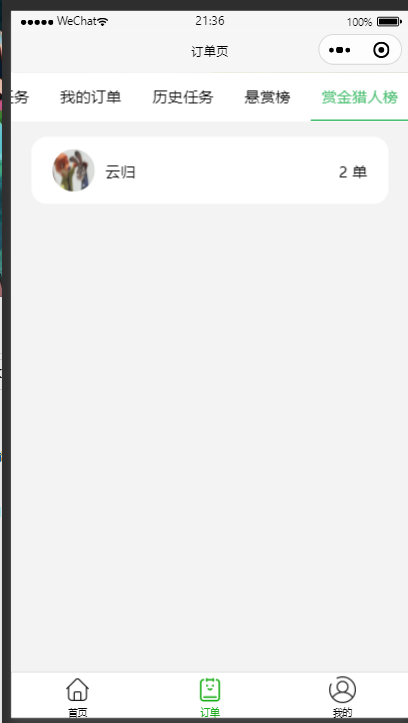
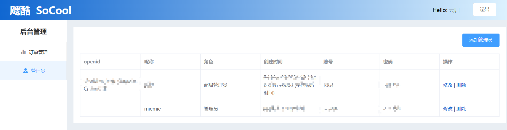

# SoCool 飕酷

**微信小程序项目 + 后台管理 --SoCool**

## Recommended IDE Setup

微信开发者工具 + vscode

## Technology Stack

前端：微信小程序、Vue2、VueCli、VueRouter3.x、Vuex、Axios、ElementUI、Cors

后端：Nodejs 、Express、Mongodb

## Run

小程序端-- **miniprograms:** 扫码登录后直接编译

project setup: `npm install`

后端-- **sever:** ` nodemon .\index.js` 或 ` node .\index.js`

后台--**admin：**`npm run serve`

## Project Show

### 小程序端：

### 后台

